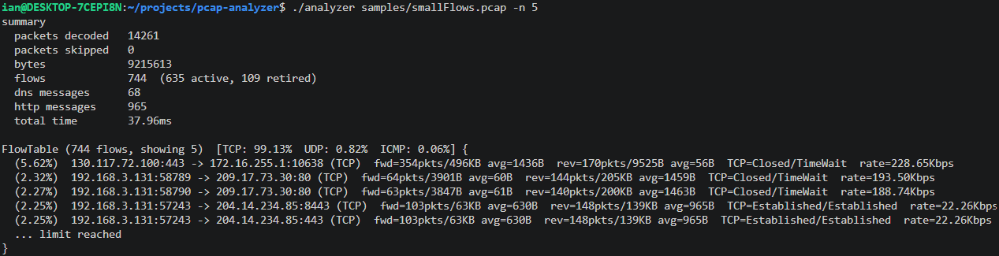

# pcap-analyzer

[](https://github.com/rootrc/pcap-analyzer/actions/workflows/ci.yml)


## Overview

`pcap-analyzer` is a command-line tool that reads offline `.pcap` capture files and decodes them from the Ethernet layer up through HTTP, printing a human-readable summary of the traffic. It reconstructs bidirectional flows, reassembles TCP byte streams out of individual packets, and extracts higher-level DNS and HTTP messages from the reassembled data.

The project was built to demonstrate protocol-level networking knowledge and systems-programming skills in C++: parsing binary wire formats correctly (including endianness, checksums, and RFC-compliant edge cases), managing stateful reassembly, and doing it all without pulling in a packet-parsing library.



## Key Features

- **Full protocol stack decoding** — Ethernet II, VLAN tagging, ARP, IPv4, IPv6, ICMP, ICMPv6, TCP, and UDP, all implemented from scratch against RFC references.
- **TCP stream reassembly** — out-of-order segment buffering, sequence-number wraparound handling, and TCP state tracking, so application data can be read as a contiguous stream rather than individual packets.
- **Application-layer extraction** — DNS message parsing (with compression-pointer following and a jump-count ceiling to guard against pointer loops) and HTTP/1.x request/response framing.
- **RFC-conscious HTTP parsing** — handles `Transfer-Encoding` / `Content-Length` interactions per RFC 9110/9112 to avoid the classic request-smuggling ambiguity.
- **Flow tracking** — 5-tuple flow keys with idle/active timeouts and per-direction byte/packet counters.
- **Zero runtime dependencies** — the core library and CLI use only the C++ standard library and OS APIs (mmap on POSIX, memory-mapped files on Windows); GoogleTest is only needed to build the test suite.
- **Copy-minimizing design** — decoded layers operate on buffer views (`std::span`) into the memory-mapped capture rather than copying data; the only copy made is for buffering out-of-order TCP segments.

## Supported Protocols (L1–L7)

Every protocol below is decoded by a from-scratch parser under [include/net/protocols/](include/net/protocols/) / [src/net/protocols/](src/net/protocols/), each implemented against the RFC (or spec) referenced in that header's source comment

| OSI Layer | Protocol | Reference | Notes |
|---|---|---|---|
| L1 – Physical | *(not applicable)* | — | `pcap-analyzer` consumes pre-captured frames from a `.pcap` file; it does not touch a physical medium or NIC. |
| L2 – Data Link | Ethernet II | IEEE 802.3 | Source/destination MAC, EtherType dispatch to ARP/IPv4/IPv6/VLAN. |
| L2 – Data Link | VLAN (802.1Q / 802.1ad) | — | Up to `MAX_TAGS` (4) stacked tags per frame; extracts PCP, DEI, and VLAN ID from the TCI field, including Q-in-Q (`0x88A8`). |
| L3 – Network | ARP | RFC 826 | Request/reply operations; sender/target hardware and protocol addresses. |
| L3 – Network | IPv4 | RFC 791 | Header validation incl. IHL/version, flags (DF/MF), fragment offset, TTL, protocol dispatch, checksum. |
| L3 – Network | IPv6 | RFC 8200 | Fixed 40-byte header, traffic class / flow label extraction, next-header dispatch, pseudo-header checksum computation for upper-layer validation. |
| L3 – Network | ICMP | RFC 792 | Echo request/reply, destination unreachable, source quench, redirect, TTL exceeded, parameter problem, timestamp, and info request/reply types, each with their defined codes (e.g. net/host/port unreachable). |
| L3 – Network | ICMPv6 | RFC 4443 | Destination unreachable, packet-too-big, TTL exceeded, parameter problem, echo request/reply, and router/neighbor solicitation/advertisement message types. |
| L4 – Transport | TCP | RFC 793 / RFC 9293 | Full flag set (CWR/ECE/URG/ACK/PSH/RST/SYN/FIN), sequence/ack numbers, window size, checksum; feeds the stream reassembler in [flow/tcp_reassembler](include/net/flow/tcp_reassembler.h) (out-of-order buffering, sequence-space wraparound, connection state machine). |
| L4 – Transport | UDP | RFC 768 | Source/destination port, length, checksum validation against the IPv4/IPv6 pseudo-header. |
| L7 – Application | DNS | RFC 1035 | Header + question/resource records; record types A, NS, CNAME, SOA, PTR, MX, TXT, AAAA, SRV; class IN; name-compression pointer following with a 10-jump ceiling to prevent pointer loops; reply codes (format/server/name/not-implemented/refused errors). |
| L7 – Application | HTTP/1.0 & HTTP/1.1 | RFC 9110 / RFC 9112 | Request and response message framing over a reassembled TCP stream; method, target, version, status code, reason phrase, and header fields; `Content-Length` vs. `Transfer-Encoding: chunked` resolution per RFC 9112 §6.3 to avoid request-smuggling ambiguity. |

**Not decoded:** any link type other than Ethernet II (e.g. Wi-Fi/radiotap, Linux cooked capture), IP options/extension headers beyond what's needed for header-length parsing, IPv6 fragmentation, and any application protocol other than DNS and HTTP/1.x (e.g. TLS is passed through as opaque TCP payload, not decrypted or parsed).

## Architecture

See [architecture.md](architecture.md) for a diagram of the read → decode → flow-track → app-decode pipeline (mmap'd reader → per-packet L2/L3/L4 decoder → flow tracker → TCP reassembler / UDP passthrough → DNS/HTTP app decoder).

## Tech Stack

| Category | Technology |
|---|---|
| Language | C++20 |
| Build system | CMake ≥ 3.16 |
| Testing | GoogleTest (`gtest_discover_tests` via CTest) |
| Capture format | libpcap classic format (`.pcap`), Ethernet link-layer only |
| Platform APIs | POSIX `mmap` (Linux/macOS) / Windows memory-mapped files, used to read capture files without copying them into a buffer |

## Prerequisites & Installation

### Prerequisites

- **CMake 3.16 or newer** (declared in [CMakeLists.txt](CMakeLists.txt))
- **A C++20-capable compiler**
  - Linux: GCC or Clang (developed against GCC 15)
  - Windows: MinGW-w64 (the provided build script targets the `MinGW Makefiles` CMake generator)
- **GoogleTest development package** — only required if you want to build and run the test suite (`libgtest-dev` on Debian/Ubuntu, or any install discoverable by CMake's `find_package(GTest REQUIRED)`)
- **Git**, to clone the repository

### Installation

```bash
git clone https://github.com/rootrc/pcap-analyzer.git
cd pcap-analyzer
```

**Linux/macOS:**

```bash
./scripts/build.sh
```

**Windows:**

```bat
.\scripts\build.bat
```

Both scripts configure CMake into a `build/` directory with testing disabled and build the `analyzer` executable, which is placed in the project root (`RUNTIME_OUTPUT_DIRECTORY` is set to the source root in [src/CMakeLists.txt](src/CMakeLists.txt)).

## Usage

Run the built binary against any classic-format `.pcap` file:

```bash
./analyzer <capture.pcap> [options]
```

| Option | Description |
|---|---|
| `-f`, `--flows` | Print a per-flow table, sorted by bytes. |
| `-H`, `--http` | Print HTTP requests and responses, grouped by flow. |
| `-d`, `--dns` | Print DNS questions and answers, and resolved names. |
| `-s`, `--summary` | Print packet, flow, and byte counters. |
| `-a`, `--all` | Print all available sections. |
| `-n`, `--limit N` | Print at most N rows per section (`0` = no limit). |
| `-h`, `--help` | Display the help message. |

If no output-selection option is given, `analyzer` defaults to `--summary --flows`.

### Example

```bash
./analyzer samples/smallFlows.pcap -n 5
```

```
summary
  packets decoded   14261
  packets skipped   0
  bytes             9215613
  flows             747  (635 active, 112 retired)
  dns messages      68
  http messages     965

FlowTable (747 flows, showing 5)  [TCP: 99.13%  UDP: 0.82%  ICMP: 0.06%] {
  (5.62%)  130.117.72.100:443 -> 172.16.255.1:10638 (TCP)  fwd=354pkts/496KB avg=1436B  rev=170pkts/9525B avg=56B  TCP=Closed/TimeWait  rate=228.65Kbps
  (2.32%)  192.168.3.131:58789 -> 209.17.73.30:80 (TCP)  fwd=64pkts/3901B avg=60B  rev=144pkts/205KB avg=1459B  TCP=Closed/TimeWait  rate=193.50Kbps
  (2.27%)  192.168.3.131:58790 -> 209.17.73.30:80 (TCP)  fwd=63pkts/3847B avg=61B  rev=140pkts/200KB avg=1463B  TCP=Closed/TimeWait  rate=188.74Kbps
  (2.25%)  192.168.3.131:57243 -> 204.14.234.85:443 (TCP)  fwd=103pkts/63KB avg=630B  rev=148pkts/139KB avg=965B  TCP=Established/Established  rate=22.26Kbps
  (2.25%)  192.168.3.131:57243 -> 204.14.234.85:8443 (TCP)  fwd=103pkts/63KB avg=630B  rev=148pkts/139KB avg=965B  TCP=Established/Established  rate=22.26Kbps
  ... limit reached
}
```

## Development

### Build

```bash
./scripts/build.sh      # Linux/macOS
.\scripts\build.bat     # Windows
```

Internally this runs:

```bash
cmake -S . -B build -DBUILD_TESTING=OFF
cmake --build build
```

### Test

```bash
./scripts/test.sh [iterations]      # Linux/macOS, default 100 iterations
.\scripts\test.bat [iterations]     # Windows
```

Internally this runs:

```bash
cmake -S . -B build -DBUILD_TESTING=ON -DRANDOMIZED_ITERATIONS=<iterations>
cmake --build build -j2
ctest --test-dir build --progress
```

Each protocol and capture-format module (Ethernet, VLAN, IPv4, IPv6, ARP, TCP, UDP, ICMP, ICMPv6, DNS, HTTP, and the pcap reader itself) has its own GoogleTest binary, discovered and run individually via `ctest`; see [tests/CMakeLists.txt](tests/CMakeLists.txt) for the full list.

## Known Limitations / Future Improvements

- **Classic pcap only** — reads the libpcap `.pcap` format; `.pcapng` is not supported (see [include/net/capture/pcap.h](include/net/capture/pcap.h)).
- **Ethernet link-layer only** — other link types (e.g. Wi-Fi radiotap, Linux cooked capture) are not decoded.
- **Offline analysis only** — there is no live-capture mode; input must be a capture file on disk.
- **Single-threaded** — capture files are processed sequentially; large files are read via mmap but decoding itself does not parallelize.
- **HTTP/1.x only** — no HTTP/2 or HTTP/3 (QUIC) support.
- **Console output only** — results are printed to stdout; there's no JSON/CSV export or programmatic API for downstream tooling yet.

## Credits

`samples/smallFlows.pcap` is from the [tcpreplay / AppNeta sample captures](https://tcpreplay.appneta.com/reference/sample-captures/) collection. See [samples/README.md](samples/README.md).

## License

MIT — see [LICENSE](LICENSE). Copyright (c) 2026 rootrc.
